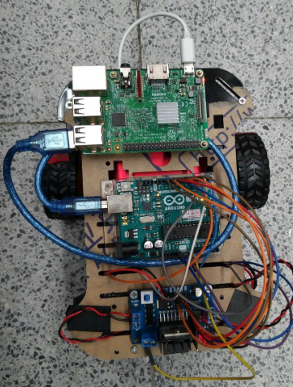

## Mobile Robots Course 自走式機器人 @ NYCU
### fall semester  

#### Materials
+ Raspberry Pi 3 Model B
+ Arduino UNO  

#### My mobile robot (use on checkpoint 1~4)
  

#### folders (checkpoint 1~4 & final project)
+ cp1

+ ch2

+ ch3

+ ch4 (& hockey robot contest)

+ (cool robot show) final project
  + our_robot  
    

  + demo_video  
    **/cool robot show/demo_video.mp4**
    
